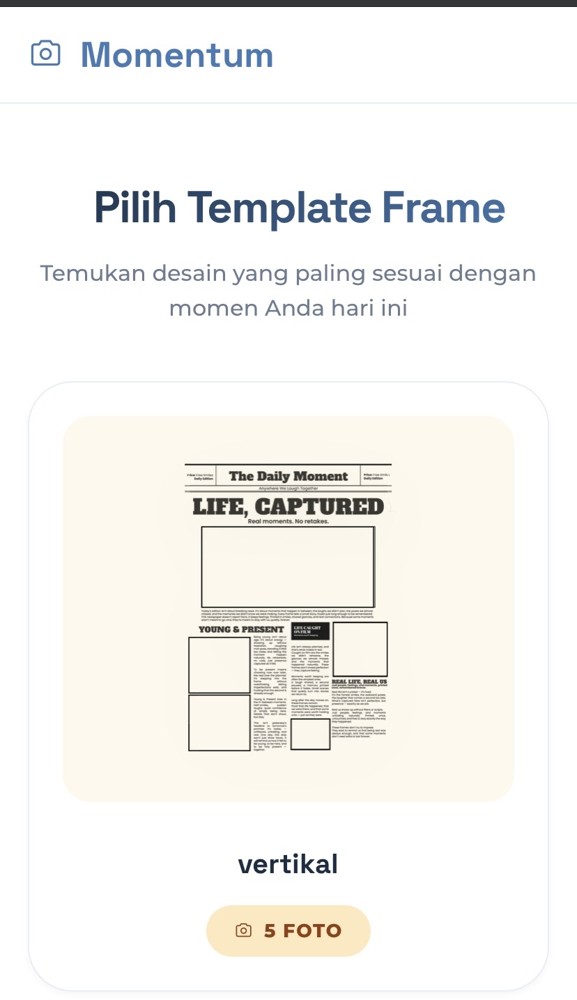
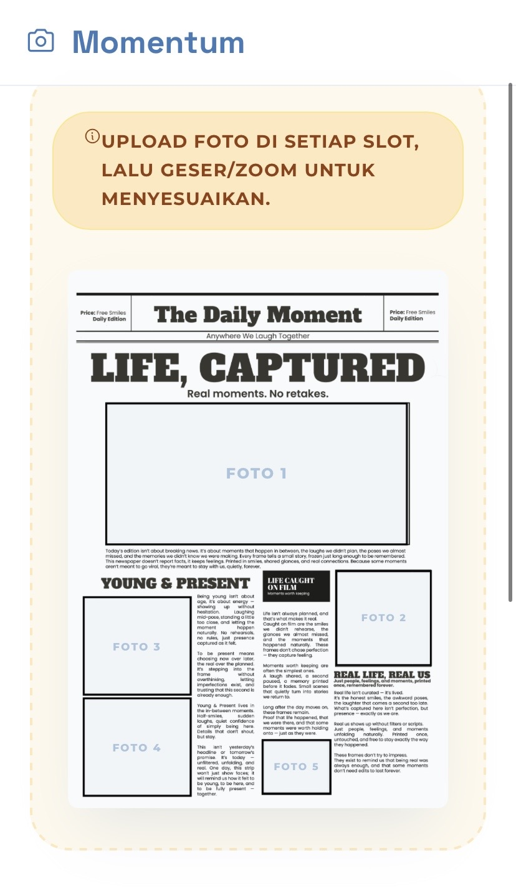
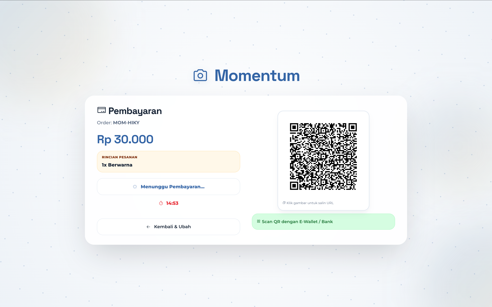

#  Momentum Photobooth

<p align="center">
  <strong>Sistem Manajemen Photobooth Pintar dengan Integrasi QRIS & Editor Real-time.</strong>
</p>

<p align="center">
  
  
  
  
  
</p>

---

##  Tentang Proyek

**Momentum Photobooth** bukan sekadar aplikasi upload foto. Ini adalah ekosistem lengkap untuk bisnis photobooth mandiri. Aplikasi ini menjembatani celah antara keinginan pelanggan untuk mengedit foto mereka sendiri secara santai di smartphone mereka, dengan kecepatan proses cetak otomatis di mesin booth fisik.

### Mengapa Momentum?
- **User Empowerment**: Pelanggan tidak perlu terburu-buru di depan mesin. Mereka bisa upload, zoom, dan mengatur posisi foto dari HP masing-masing.
- **Kiosk Efficiency**: Mengurangi antrean di mesin fisik. Pelanggan datang ke booth hanya untuk scan kode dan membayar.
- **Revenue Ready**: Integrasi QRIS memastikan pembayaran masuk secara instan sebelum proses cetak dimulai.

---

##  Daftar Isi
- [Fitur Utama](#-fitur-utama)
- [Demo Visual](#-demo-visual)
- [Teknologi](#-teknologi)
- [Instalasi](#-instalasi)
- [Panduan Penggunaan](#-panduan-penggunaan)
- [Konfigurasi](#-konfigurasi)
- [Roadmap](#-roadmap)
- [Kontribusi](#-kontribusi)

---

##  Fitur Utama

###  Alur Pelanggan (Web Mobile)
- **Editor Interaktif**: Geser, Zoom, Rotasi, dan Mirror foto secara real-time.
- **Multi-Frame Selection**: Berbagai pilihan template yang dikelola dari admin.
- **Code Generation**: Sistem kode unik untuk sinkronisasi data ke mesin booth.

###  Alur Booth (Kiosk Mode)
- **Silent Printing**: Cetak otomatis tanpa campur tangan operator.
- **Integrasi QRIS**: Verifikasi pembayaran otomatis dari Midtrans.
- **Kiosk Mode Optimized**: Antarmuka tanpa kursor, mendukung layar sentuh penuh.

###  Panel Admin
- **Statistik Mendalam**: Pantau pendapatan harian, bulanan, dan tahunan.
- **Manajemen Frame**: Upload dan atur koordinat slot foto secara dinamis.
- **Reset Otomatis**: Statistik harian diperbarui tepat jam 12 malam WIB.

---

##  Demo Visual

| Halaman Pemilihan Frame | Editor Foto Mobile | Pembayaran QRIS |
| :---: | :---: | :---: |
|  |  |  |

---

##  Teknologi

Aplikasi ini dibangun menggunakan tumpukan teknologi modern untuk memastikan performa dan skalabilitas:

<p align="left">
  
  
  
  
  
  
  
</p>

- **Backend Logic**: Laravel 12 dengan sistem arsitektur MVC yang bersih.
- **Frontend Animations**: GSAP untuk transisi antarmuka yang sangat halus.
- **Image Editor**: Moveable.js untuk manipulasi foto yang fleksibel.
- **Payment Gateway**: Midtrans Snap API untuk integrasi pembayaran QRIS yang aman.

---

##  Instalasi

Ikuti langkah berikut untuk menjalankan proyek secara lokal:

### 1. Persyaratan Sistem
- PHP >= 8.2
- Composer
- Node.js & NPM
- MySQL 8.0+

### 2. Langkah Setup
```bash
# Clone repository
git clone https://github.com/mochhary/Momentum.git

# Install dependensi PHP
composer install

# Install & Build aset frontend
npm install
npm run build

# Salin environment file
cp .env.example .env
php artisan key:generate
```

---

##  Konfigurasi

Pastikan Anda mengisi variabel berikut di `.env`:

```env
# Midtrans Credentials
MIDTRANS_SERVER_KEY=your_server_key
MIDTRANS_CLIENT_KEY=your_client_key
MIDTRANS_IS_PRODUCTION=false

# Timezone & Locale
APP_TIMEZONE=Asia/Jakarta
APP_LOCALE=id

# Booth Security
BOOTH_SECRET_TOKEN=isi_token_anda_disini
```

---

##  Roadmap
- [x] Integrasi Midtrans QRIS
- [x] Fitur Auto-Print (Silent)
- [x] Mode Foto (Color & B&W)
- [ ] Support Multi-Booth dalam satu Admin
- [ ] Fitur Filter Lanjutan (Sepia, Vivid, dsb)
- [ ] Integrasi Cloud Storage untuk Backup Foto

---

##  Kontribusi

Kontribusi selalu terbuka! Jika Anda memiliki ide atau menemukan bug, silakan buat *issue* atau kirimkan *pull request*.

1. Fork Proyek ini
2. Buat Branch Fitur (`git checkout -b fitur/Hebat`)
3. Commit Perubahan (`git commit -m 'Menambah fitur Hebat'`)
4. Push ke Branch (`git push origin fitur/Hebat`)
5. Buat Pull Request

---

##  Lisensi

Didistribusikan di bawah Lisensi **MIT**. Lihat `LICENSE` untuk informasi lebih lanjut.

---

<p align="center">
  Dibuat dengan  oleh <strong>Moch Hary</strong><br>
  Let's Capture Every Moment!
</p>
